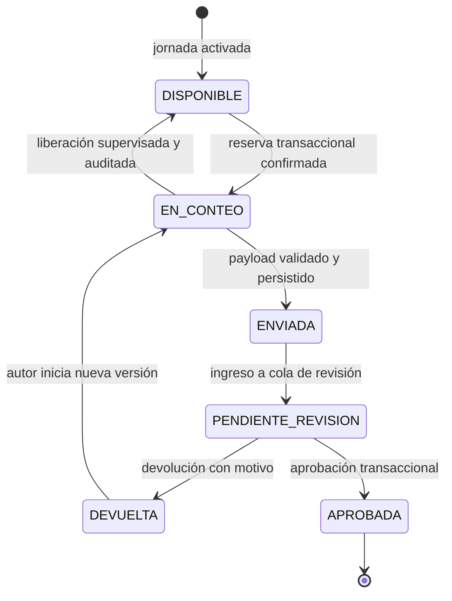

# Flujo de jornada de inventario

## 1. Conceptos

- **Jornada:** unidad administrativa que agrupa las líneas que deben contarse.
- **Línea de jornada:** relación entre una línea del catálogo y una jornada; tiene su propio estado operativo.
- **Reserva:** derecho temporal y exclusivo a contar una línea de jornada, confirmado por el servidor.
- **Conteo:** envío inmutable con hembras, machos, patrones, observaciones y trazabilidad.
- **Versión:** nueva corrección vinculada a un conteo anterior; nunca lo sobrescribe.
- **Inventario oficial:** única representación central vigente, modificable solo al aprobar mediante una transacción.

## 2. Creación y activación de una jornada

1. Un supervisor o administrador crea la jornada en Vivero Maestro.
2. Selecciona líneas existentes en el catálogo central. No escribe manualmente módulo, cama o línea.
3. El sistema valida que no haya líneas repetidas dentro de la jornada.
4. Se definen las autorizaciones de acceso conforme a la política que aún debe aprobarse.
5. Antes de activar, Vivero Maestro muestra un resumen de la jornada y sus líneas.
6. Al activar, cada línea inicia en `DISPONIBLE`.
7. La activación y toda modificación posterior dejan auditoría.

No se fijan en esta etapa nombres ni estados adicionales de jornada. El ciclo administrativo completo de borrador, activación, cancelación y cierre es una decisión pendiente.

## 3. Reserva de una línea

La reserva requiere conexión porque la exclusividad solo puede decidirla la fuente central.

### Operación transaccional

1. Vivero Campo solicita reservar una línea enviando jornada, línea, usuario, dispositivo y una clave única de solicitud.
2. La transacción verifica:
   - sesión y rol vigentes;
   - autorización para la jornada;
   - jornada activa;
   - línea en estado `DISPONIBLE`;
   - ausencia de otra reserva activa;
   - pertenencia de la línea a esa jornada.
3. Si todo se cumple, crea la reserva y cambia la línea a `EN_CONTEO` en la misma transacción.
4. Devuelve un identificador global y un token o versión de reserva que deberá acompañar el conteo.
5. Si otro usuario ganó la reserva, no se sobrescribe; se devuelve el estado central actual.

Todos los usuarios, incluida la cuenta maestra, ejecutan esta misma operación.

## 4. Conteo y almacenamiento local

Después de confirmar la reserva:

1. Se abre un formulario asociado de manera no editable a jornada, línea, usuario, dispositivo y reserva.
2. El usuario registra enteros no negativos para hembras, machos y patrones.
3. El total se calcula como `hembras + machos + patrones`.
4. Las observaciones son opcionales, salvo que una regla operativa futura las haga obligatorias en un caso concreto.
5. El borrador se guarda localmente y se actualiza durante el trabajo.
6. Si se cierra la aplicación, el borrador se recupera al abrirla de nuevo.
7. Antes del envío se muestra un resumen y se exige confirmación.

El almacenamiento local no concede ni prolonga una reserva. La hora y vigencia central prevalecen.

## 5. Sincronización

### Estados locales visibles

Estos estados pertenecen al dispositivo y no sustituyen los estados centrales de la línea:

- **PENDIENTE:** borrador confirmado localmente, esperando envío o conexión.
- **SINCRONIZANDO:** solicitud en curso.
- **ENVIADO:** servidor confirmó el mismo conteo y devolvió su ID y estado.
- **ERROR:** el servidor rechazó la solicitud o no fue posible completarla; se conserva el borrador y se muestra una causa accionable.

### Envío idempotente

1. Al confirmar, el dispositivo crea una clave idempotente global para ese envío lógico.
2. Los reintentos conservan la misma clave y el mismo contenido.
3. El servidor valida reserva, identidad, campos, versión y permisos.
4. Si la clave ya fue procesada, devuelve el resultado almacenado sin crear otro conteo ni otra actualización.
5. Si el contenido cambia después de un error corregible, se crea un nuevo intento lógico con una nueva clave; no se reutiliza una clave con contenido distinto.
6. Al aceptar el original, el servidor registra horas de dispositivo y servidor, deja la versión inmutable y cambia la línea a `ENVIADA`.
7. El sistema incorpora el envío a la cola de revisión y cambia la línea a `PENDIENTE_REVISION`.

`ENVIADA` significa que el payload fue recibido y persistido. `PENDIENTE_REVISION` significa que ya está disponible para una decisión humana. Esta separación permite detectar y reconciliar un envío persistido que, por una falla interna, aún no haya entrado a la cola de revisión.

## 6. Revisión

Un supervisor o administrador abre una línea `PENDIENTE_REVISION` y ve:

- ubicación tomada del catálogo;
- jornada y versión de conteo;
- hembras, machos, patrones y total;
- observaciones;
- autor, rol efectivo y dispositivo;
- horas del dispositivo y del servidor;
- versiones anteriores y eventos de revisión;
- advertencias de validación o de diferencia de reloj.

Puede aprobar, devolver o solicitar verificación. Toda decisión exige confirmación y queda auditada.

### Solicitud de verificación

Los estados suministrados no incluyen `EN_VERIFICACION`. Para no inventar una transición, la solicitud se registra como un evento de revisión y la línea permanece `PENDIENTE_REVISION`, sin afectar el inventario. Debe definirse quién verifica, cómo se le asigna la tarea y qué resultado devuelve antes de implementar este flujo.

## 7. Devolución y corrección

1. El revisor indica un motivo obligatorio y devuelve la versión.
2. La línea pasa de `PENDIENTE_REVISION` a `DEVUELTA`.
3. El conteo original queda inmutable.
4. Solo el autor puede iniciar la corrección prevista actualmente.
5. Al abrirla, la línea pasa de `DEVUELTA` a `EN_CONTEO` y se crea un borrador basado en la versión previa, sin editarla.
6. El nuevo envío crea otra versión, enlaza la anterior y recorre `ENVIADA` y `PENDIENTE_REVISION`.
7. El revisor compara versiones; el sistema no promedia ni decide automáticamente.

Si el autor no puede corregir, el tratamiento o reasignación queda pendiente de política. Nunca se transferirá la autoría del original.

## 8. Aprobación e inventario oficial

La aprobación se ejecuta en una transacción central:

1. Valida sesión, rol y alcance del revisor.
2. Comprueba que la línea y la versión siguen `PENDIENTE_REVISION`.
3. Comprueba que esa versión no fue aplicada antes.
4. Verifica que los valores sean válidos y que la operación no produzca inventario negativo.
5. Aplica la política aprobada de consolidación al único inventario oficial.
6. Registra la versión fuente, inventario anterior, resultado, revisor y hora del servidor.
7. Cambia la línea a `APROBADA` y escribe el evento de auditoría.

Si la misma aprobación se repite, la clave idempotente y el marcador de versión aplicada hacen que el servidor devuelva el resultado previo sin aplicar un segundo cambio.

No se define aún si aprobar reemplaza la fotografía oficial de la línea o genera otro tipo de movimiento; esa política debe decidirse con los datos reales del vivero.

## 9. Línea abandonada y liberación supervisada

Una línea puede considerarse posiblemente abandonada si permanece `EN_CONTEO` sin actividad central conforme a una política todavía no definida. No debe liberarse automáticamente usando solo la hora del celular.

Procedimiento mínimo:

1. Vivero Maestro muestra reserva, último contacto central, usuario y dispositivo.
2. Un supervisor o administrador verifica la situación por el procedimiento operativo acordado.
3. Indica un motivo y confirma la liberación.
4. Una transacción valida que la reserva no cambió, la marca liberada y devuelve la línea a `DISPONIBLE`.
5. La liberación queda auditada.
6. Un borrador tardío asociado al token anterior es rechazado como envío normal, se conserva y se presenta para recuperación supervisada; nunca sobrescribe un conteo posterior.

El tiempo de abandono, avisos, contactos y posibilidad de recuperar el borrador son decisiones pendientes.

## 10. Pérdida de conexión

- **Antes de reservar:** no se puede obtener una línea nueva; la aplicación explica que hace falta conexión.
- **Después de reservar:** se puede contar y guardar localmente.
- **Al enviar sin señal:** queda `PENDIENTE`, no se muestra como enviado.
- **Al reconectar:** se consulta el estado central y se sincroniza con la misma clave idempotente.
- **Si la reserva ya no es válida:** el borrador no se elimina; se bloquea el envío automático y se solicita intervención supervisada.

### Reserva anticipada de bloques

Se estudiará reservar anticipadamente un bloque pequeño de líneas en zonas con mala señal. No se implementará en el primer MVP hasta definir tamaño máximo, duración, devolución de líneas no usadas, equidad entre usuarios, visibilidad y riesgo de bloqueo. Aunque fuera un bloque, cada línea necesitaría una reserva central exclusiva antes de quedar sin conexión.

## 11. Cierre de jornada

Vivero Maestro debe mostrar un resumen por estado antes de cerrar. Por defecto, no debería permitir el cierre ordinario mientras existan líneas `DISPONIBLE`, `EN_CONTEO`, `ENVIADA`, `PENDIENTE_REVISION` o `DEVUELTA`. El cierre no elimina reservas, conteos ni auditoría.

La posibilidad de cierre excepcional, cancelación de líneas y reapertura requiere una política explícita antes de implementar.

## 12. Diagrama de estados de una línea

Solicitar verificación genera un evento sin salir de `PENDIENTE_REVISION` hasta que se apruebe una política específica.

## 13. Tabla formal de transiciones

| Origen | Destino | Actor autorizado | Condiciones principales |
|---|---|---|---|
| Inicio | `DISPONIBLE` | Sistema por orden de supervisor/administrador | Jornada activada y línea válida del catálogo. |
| `DISPONIBLE` | `EN_CONTEO` | Auxiliar, supervisor o administrador desde Campo | Autorización, conexión y reserva transaccional ganada. |
| `EN_CONTEO` | `DISPONIBLE` | Supervisor o administrador | Liberación explícita, motivo, token vigente y auditoría. |
| `EN_CONTEO` | `ENVIADA` | Titular de la reserva | Conteo válido, token vigente, confirmación e idempotencia. |
| `ENVIADA` | `PENDIENTE_REVISION` | Sistema | Payload persistido y cola de revisión creada. |
| `PENDIENTE_REVISION` | `DEVUELTA` | Supervisor o administrador | Motivo obligatorio y versión aún pendiente. |
| `DEVUELTA` | `EN_CONTEO` | Autor de la versión devuelta | Inicio de una nueva versión; política de reasignación pendiente. |
| `PENDIENTE_REVISION` | `APROBADA` | Supervisor o administrador | Aprobación transaccional, autorizada e idempotente. |

No se permiten saltos directos de `DISPONIBLE` a `ENVIADA`, de `ENVIADA` a `APROBADA`, de `DEVUELTA` a `APROBADA`, ni de `APROBADA` a otro estado sin una futura política formal de reapertura.
