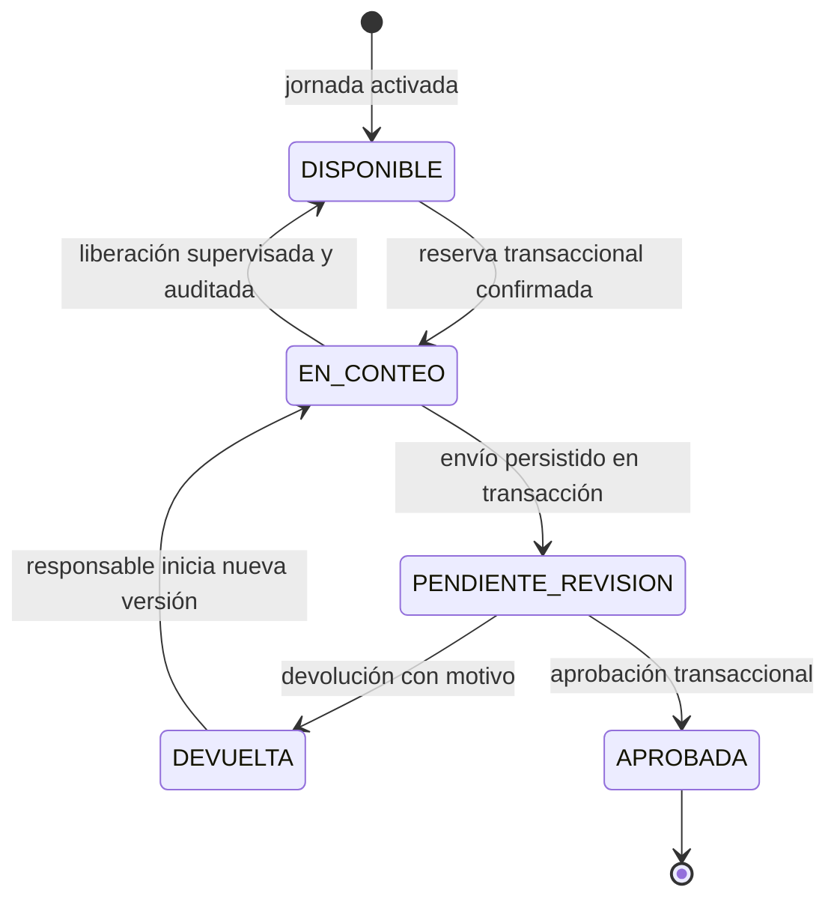

# Flujo de jornada de inventario

## 1. Conceptos

- **Jornada:** unidad administrativa que agrupa las líneas que deben contarse.
- **Línea de jornada:** relación entre una línea del catálogo y una jornada; tiene su propio estado operativo.
- **Reserva:** derecho temporal y exclusivo a contar una línea de jornada, confirmado por el servidor.
- **Conteo:** envío inmutable con hembras, machos, patrones, observaciones y trazabilidad.
- **Versión:** nueva corrección vinculada a un conteo anterior; nunca lo sobrescribe.
- **Inventario oficial:** única representación central vigente, modificable solo al aprobar mediante una transacción.

Los estados centrales de una línea de jornada son `DISPONIBLE`, `EN_CONTEO`, `PENDIENTE_REVISION`, `DEVUELTA` y `APROBADA`. `ENVIADA` pertenece al estado local de sincronización de Vivero Campo y nunca se almacena como estado central de la línea.

## 2. Creación y activación de una jornada

1. Un supervisor o administrador crea la jornada en Vivero Maestro.
2. Selecciona líneas existentes en el catálogo central. No escribe manualmente módulo, cama o línea.
3. El sistema valida que no haya líneas repetidas dentro de la jornada.
4. Se definen las autorizaciones de acceso conforme a la política que aún debe aprobarse.
5. Antes de activar, Vivero Maestro muestra un resumen de la jornada y sus líneas.
6. Al activar, cada línea inicia en `DISPONIBLE`.
7. La activación y toda modificación posterior dejan auditoría.

No se fijan en esta etapa nombres ni estados adicionales de jornada. El ciclo administrativo completo de borrador, activación, cancelación y cierre es una decisión pendiente.

## 3. Reserva de una línea

La reserva requiere conexión porque la exclusividad solo puede decidirla la fuente central.

### Operación transaccional

1. Vivero Campo solicita reservar una línea enviando jornada, línea, usuario, dispositivo y una clave única de solicitud.
2. La transacción verifica:
   - sesión y rol vigentes;
   - autorización para la jornada;
   - jornada activa;
   - línea en estado `DISPONIBLE`;
   - ausencia de otra reserva activa;
   - pertenencia de la línea a esa jornada.
3. Si todo se cumple, crea la reserva y cambia la línea a `EN_CONTEO` en la misma transacción.
4. Devuelve un identificador global y un token o versión de reserva que deberá acompañar el conteo.
5. Si otro usuario ganó la reserva, no se sobrescribe; se devuelve el estado central actual.

Todos los usuarios, incluida la cuenta maestra, ejecutan esta misma operación.

## 4. Conteo y almacenamiento local

Después de confirmar la reserva:

1. Se abre un formulario asociado de manera no editable a jornada, línea, usuario, dispositivo y reserva.
2. El usuario registra enteros no negativos para hembras, machos y patrones.
3. El total se calcula como `hembras + machos + patrones`.
4. Las observaciones son opcionales, salvo que una regla operativa futura las haga obligatorias en un caso concreto.
5. El borrador se guarda localmente y se actualiza durante el trabajo.
6. Si se cierra la aplicación, el borrador se recupera al abrirla de nuevo.
7. Antes del envío se muestra un resumen y se exige confirmación.

El almacenamiento local no concede ni prolonga una reserva. La hora y vigencia central prevalecen.

## 5. Sincronización

### Estados locales visibles

Estos estados pertenecen al dispositivo y no sustituyen los estados centrales de la línea:

- **PENDIENTE:** borrador confirmado localmente, esperando envío o conexión.
- **SINCRONIZANDO:** solicitud en curso.
- **ENVIADA:** servidor confirmó el mismo conteo y devolvió su ID y estado central.
- **ERROR:** el servidor rechazó la solicitud o no fue posible completarla; se conserva el borrador y se muestra una causa accionable.

### Envío idempotente

1. Al confirmar, el dispositivo crea una clave idempotente global para ese envío lógico.
2. Los reintentos conservan la misma clave y el mismo contenido.
3. El servidor valida reserva, identidad, campos, versión y permisos.
4. Si la clave ya fue procesada, devuelve el resultado almacenado sin crear otro conteo ni otra actualización.
5. Si el contenido cambia después de un error corregible, se crea un nuevo intento lógico con una nueva clave; no se reutiliza una clave con contenido distinto.
6. En una sola transacción, el servidor registra las horas de dispositivo y servidor, deja la versión inmutable, marca la reserva como consumida y cambia la línea central de `EN_CONTEO` a `PENDIENTE_REVISION`.
7. Después de confirmar esa transacción, Vivero Campo cambia el estado local a `ENVIADA`.

`ENVIADA` significa únicamente que el dispositivo recibió la confirmación del servidor. Si la respuesta se pierde, el dispositivo conserva la misma clave idempotente y consulta o reintenta; la transacción central nunca deja una línea en un estado intermedio `ENVIADA`.

## 6. Revisión

Un supervisor o administrador abre una línea `PENDIENTE_REVISION` y ve:

- ubicación tomada del catálogo;
- jornada y versión de conteo;
- hembras, machos, patrones y total;
- observaciones;
- autor, rol efectivo y dispositivo;
- horas del dispositivo y del servidor;
- versiones anteriores y eventos de revisión;
- advertencias de validación o de diferencia de reloj.

En el primer MVP puede aprobar o devolver. Toda decisión exige confirmación y queda auditada. La verificación adicional queda fuera del MVP y no se implementará como acción ni como estado central.

## 7. Devolución y corrección

1. El revisor indica un motivo obligatorio y devuelve la versión.
2. La línea pasa de `PENDIENTE_REVISION` a `DEVUELTA`.
3. El conteo original queda inmutable.
4. El autor puede iniciar la corrección. Si está ausente, un supervisor o administrador puede reasignarla mediante una acción auditada a otro usuario activo y autorizado.
5. La reasignación conserva autor, dispositivo, contenido y revisión del conteo original; solo establece quién realizará la nueva versión.
6. Cuando el usuario responsable abre la corrección, una transacción crea una nueva reserva exclusiva de corrección, cambia la línea de `DEVUELTA` a `EN_CONTEO` y crea un borrador basado en la versión previa, sin editarla.
7. El nuevo envío crea otra versión, enlaza la anterior y cambia centralmente de `EN_CONTEO` a `PENDIENTE_REVISION`.
8. El revisor compara versiones; el sistema no promedia ni decide automáticamente.

La reasignación nunca transfiere la autoría del original ni permite editarlo.

## 8. Aprobación e inventario oficial

La aprobación se ejecuta en una transacción central:

1. Valida sesión, rol y alcance del revisor.
2. Comprueba que la línea y la versión siguen `PENDIENTE_REVISION`.
3. Comprueba que esa versión no fue aplicada antes.
4. Lee la fotografía oficial vigente de esa línea y verifica que los valores sean válidos y no negativos.
5. Calcula por categoría y total la diferencia `conteo aprobado - inventario anterior`.
6. Reemplaza la fotografía oficial de la línea con el conteo aprobado.
7. Registra un movimiento histórico con los valores anteriores, los nuevos y sus diferencias.
8. Registra la versión fuente, revisor y hora del servidor.
9. Cambia la línea a `APROBADA` y escribe el evento de auditoría.

Si la misma aprobación se repite, la clave idempotente y el marcador de versión aplicada hacen que el servidor devuelva el resultado previo sin aplicar un segundo cambio.

Ejemplo: si la fotografía anterior tiene un total de `1000` y el conteo aprobado tiene `980`, el inventario oficial queda en `980` y el movimiento histórico registra un ajuste total de `-20`.

Como excepción, un administrador puede aprobar su propio conteo. Vivero Maestro debe mostrar una advertencia explícita, exigir un motivo no vacío y registrar en auditoría que autor y aprobador son la misma cuenta. Un supervisor no puede aprobar su propio conteo.

## 9. Línea abandonada y liberación supervisada

Durante el MVP las reservas no vencen automáticamente. Una línea puede señalarse como posiblemente abandonada si permanece `EN_CONTEO`, pero solo una decisión humana puede liberarla.

Procedimiento mínimo:

1. Vivero Maestro muestra reserva, último contacto central, usuario y dispositivo.
2. Un supervisor o administrador verifica la situación.
3. Indica un motivo y confirma la liberación.
4. Una transacción valida que la reserva no cambió, la marca liberada y devuelve la línea a `DISPONIBLE`.
5. La liberación queda auditada.
6. Un borrador tardío asociado al token anterior es rechazado como envío normal, se conserva y se presenta para recuperación supervisada; nunca sobrescribe un conteo posterior.

No habrá temporizador ni liberación automática en el MVP. Los avisos y el procedimiento operativo detallado podrán definirse después de observar el piloto.

## 10. Pérdida de conexión

- **Antes de reservar:** no se puede obtener una línea nueva; la aplicación explica que hace falta conexión.
- **Después de reservar:** se puede contar y guardar localmente.
- **Al enviar sin señal:** queda `PENDIENTE`, no se muestra como enviado.
- **Al reconectar:** se consulta el estado central y se sincroniza con la misma clave idempotente.
- **Si la reserva ya no es válida:** el borrador no se elimina; se bloquea el envío automático y se solicita intervención supervisada.

### Reserva anticipada de bloques

No se implementará reserva anticipada de bloques en el primer MVP. La opción solo se reconsiderará después de medir la calidad real de la señal. Si posteriormente se adopta, deberán definirse tamaño máximo, duración, devolución de líneas no usadas, equidad, visibilidad y riesgo de bloqueo; cada línea seguirá necesitando una reserva central exclusiva.

## 11. Cierre de jornada

Vivero Maestro debe mostrar un resumen por estado antes de cerrar. Por defecto, no debería permitir el cierre ordinario mientras existan líneas `DISPONIBLE`, `EN_CONTEO`, `PENDIENTE_REVISION` o `DEVUELTA`. El cierre no elimina reservas, conteos ni auditoría.

La posibilidad de cierre excepcional, cancelación de líneas y reapertura requiere una política explícita antes de implementar.

## 12. Diagrama de estados de una línea

`ENVIADA` no aparece en el diagrama porque es un estado local del dispositivo posterior a la confirmación de la transición central.

## 13. Tabla formal de transiciones

| Origen | Destino | Actor autorizado | Condiciones principales |
|---|---|---|---|
| Inicio | `DISPONIBLE` | Sistema por orden de supervisor/administrador | Jornada activada y línea válida del catálogo. |
| `DISPONIBLE` | `EN_CONTEO` | Auxiliar, supervisor o administrador desde Campo | Autorización, conexión y reserva transaccional ganada. |
| `EN_CONTEO` | `DISPONIBLE` | Supervisor o administrador | Liberación explícita, motivo, token vigente y auditoría. |
| `EN_CONTEO` | `PENDIENTE_REVISION` | Titular de la reserva | Conteo válido, token vigente, persistencia y transición en una sola transacción idempotente. |
| `PENDIENTE_REVISION` | `DEVUELTA` | Supervisor o administrador | Motivo obligatorio y versión aún pendiente. |
| `DEVUELTA` | `EN_CONTEO` | Autor o usuario reasignado | Nueva reserva exclusiva de corrección; una reasignación previa requiere supervisor o administrador y auditoría. |
| `PENDIENTE_REVISION` | `APROBADA` | Supervisor o administrador | Aprobación transaccional, autorizada e idempotente. |

No se permiten saltos directos de `DISPONIBLE` a `PENDIENTE_REVISION`, de `DEVUELTA` a `APROBADA`, ni de `APROBADA` a otro estado sin una futura política formal de reapertura.
